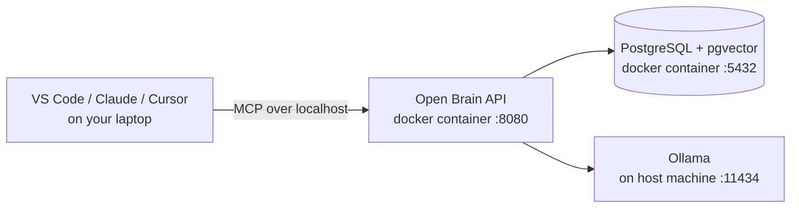

# Open Brain — Docker Desktop Dev Box (Windows & macOS)

> The friendliest possible setup. If you have a laptop and ~10 minutes, you can have a fully private, working "second brain" before lunch — no cloud account, no credit card, no Kubernetes.

This is the path most people should start with. Everything runs on your machine. Your thoughts never leave your laptop unless you choose to send them somewhere.

---

## What You're Building



Three pieces, all on your laptop:

| Piece | What it does | Where it runs |
|-------|--------------|---------------|
| **Postgres + pgvector** | Stores thoughts & vector embeddings | Docker container |
| **Open Brain API** | REST + MCP server your AI clients talk to | Docker container |
| **Ollama** | Generates embeddings & extracts metadata, free & local | Native app on host |

---

## Prerequisites

You need three things installed. If you already have them, skip to [Step 1](#step-1--clone-and-configure).

| Tool | Windows | macOS |
|------|---------|-------|
| **Docker Desktop** | [Download](https://www.docker.com/products/docker-desktop/) (enable WSL 2 backend) | [Download](https://www.docker.com/products/docker-desktop/) |
| **Ollama** | [Download](https://ollama.com/download/windows) | [Download](https://ollama.com/download/mac) — or `brew install ollama` |
| **Git** | [git-scm.com](https://git-scm.com/download/win) — or `winget install Git.Git` | Pre-installed, or `brew install git` |

**Hardware recommendations:**

- 8 GB RAM minimum, 16 GB comfortable
- ~5 GB free disk (Postgres + Ollama models)
- Any CPU made in the last ~5 years. GPU is *not* required — `nomic-embed-text` runs fine on CPU.

> **Apple Silicon (M1/M2/M3/M4):** Use Docker Desktop's default virtualization. Ollama runs natively and uses the Neural Engine — embeddings are *fast*.
>
> **Windows ARM:** Works, but use the ARM64 Docker Desktop build and `ollama` for Windows ARM (preview).

---

## Step 1 — Clone and configure

Open PowerShell (Windows) or Terminal (Mac):

```bash
git clone https://github.com/srnichols/OpenBrain.git
cd OpenBrain
```

### Option A — Run the wizard (recommended)

The wizard generates `.env`, checks Docker & Ollama, pulls models, starts the stack, and prints your MCP client config.

```powershell
# Windows
.\setup.ps1
```

```bash
# macOS
chmod +x setup.sh && ./setup.sh
```

### Option B — Manual

```bash
cp .env.example .env
```

Open `.env` and set a random `MCP_ACCESS_KEY`:

```bash
# macOS / Linux / WSL
openssl rand -hex 32

# Windows PowerShell
-join ((1..32) | ForEach-Object { '{0:x2}' -f (Get-Random -Maximum 256) })
```

Paste that value as `MCP_ACCESS_KEY=...`. Leave the rest of the defaults — they're already tuned for the dev box.

---

## Step 2 — Pull Ollama models

Ollama runs on your host, not inside Docker. Pull the two models Open Brain needs:

```bash
ollama pull nomic-embed-text   # 274 MB — embeddings (768-dim)
ollama pull llama3.2           # 2 GB   — metadata extraction
```

Verify Ollama is reachable:

```bash
curl http://localhost:11434/api/tags
```

> **Why on the host, not in Docker?** Ollama uses your CPU/GPU directly. Running it on the host means no GPU passthrough config, no slow virtualized inference, and faster cold starts.

---

## Step 3 — Start the containers

```bash
docker compose up -d
```

This pulls `pgvector/pgvector:pg17`, builds the Open Brain image, runs `db/init.sql`, and starts both services. First run takes ~2 minutes; subsequent starts are instant.

The compose file is configured so the container can reach Ollama on your host:

- **macOS / Windows:** `OLLAMA_ENDPOINT=http://host.docker.internal:11434` works automatically.
- If you customize `.env`, make sure it stays `host.docker.internal` (not `localhost`) — `localhost` inside a container means *the container itself*.

---

## Step 4 — Verify it's working

```bash
# REST API
curl http://localhost:8000/health
# → {"status":"healthy","service":"open-brain-api"}

# MCP server
curl http://localhost:8080/health
# → {"status":"healthy","service":"open-brain-mcp"}

# Capture a test thought
curl -X POST http://localhost:8000/memories \
  -H "Content-Type: application/json" \
  -d '{"content": "First thought from my dev box — Docker Desktop setup works."}'

# Search for it (full pipeline: embedding → vector search → results)
curl -X POST http://localhost:8000/memories/search \
  -H "Content-Type: application/json" \
  -d '{"query": "did the docker setup work?"}'
```

Run the full 27-test integration suite if you want belt-and-suspenders confidence:

```bash
npm install
OPENBRAIN_API_URL=http://localhost:8000 npm run test:integration
```

---

## Step 5 — Connect your AI client

The MCP endpoint on your dev box is:

```
http://localhost:8080/sse?key=<YOUR_MCP_ACCESS_KEY>
```

### VS Code / GitHub Copilot

Create `.vscode/mcp.json` in any workspace:

```json
{
  "servers": {
    "openbrain": {
      "type": "sse",
      "url": "http://localhost:8080/sse?key=YOUR_KEY"
    }
  }
}
```

Reload VS Code. The MCP tools (`capture_thought`, `search_thoughts`, etc.) become available to Copilot in agent mode.

### Claude Desktop

Edit `claude_desktop_config.json` (Windows: `%APPDATA%\Claude\`, Mac: `~/Library/Application Support/Claude/`):

```json
{
  "mcpServers": {
    "openbrain": {
      "command": "npx",
      "args": ["-y", "mcp-remote", "http://localhost:8080/sse?key=YOUR_KEY"]
    }
  }
}
```

Restart Claude Desktop.

### Cursor / Windsurf / others

See [README — Client Configuration](../README.md#client-configuration) for all 9 supported clients.

---

## Day-2 operations

| Task | Command |
|------|---------|
| Stop everything | `docker compose stop` |
| Start again | `docker compose start` |
| View API logs | `docker compose logs -f api` |
| Reset the database (⚠️ wipes thoughts) | `docker compose down -v && docker compose up -d` |
| Update to latest code | `git pull && docker compose build api && docker compose up -d` |
| Backup your thoughts | `docker exec openbrain-postgres pg_dump -U openbrain openbrain > backup.sql` |
| Restore | `cat backup.sql \| docker exec -i openbrain-postgres psql -U openbrain openbrain` |

### Where is my data?

Inside a Docker named volume (`postgres_data`). It survives container restarts and updates. It does **not** survive `docker compose down -v` or uninstalling Docker Desktop. **Back up regularly** — see the `pg_dump` command above.

---

## Troubleshooting

### `Cannot connect to Ollama`

The API container can't reach Ollama. Check:

1. Ollama is running on the host: `curl http://localhost:11434/api/tags` (from your terminal, not the container)
2. `.env` has `OLLAMA_ENDPOINT=http://host.docker.internal:11434` — **not** `localhost`
3. On Linux Docker (rare for a dev box), `host.docker.internal` doesn't exist by default — use your host's LAN IP, or add `extra_hosts: ["host.docker.internal:host-gateway"]` to `docker-compose.yml`.

### `Port 5432 already in use`

You probably have a local Postgres install. Either stop it, or change the Postgres port in `docker-compose.yml`:

```yaml
ports:
  - "5433:5432"   # host:container
```

(The API container still talks to Postgres on `5432` over the Docker network — only the host port changes.)

### Embeddings are slow

First request to Ollama loads the model into RAM and is slow (~5 sec). Subsequent calls are <100 ms. If they stay slow:

- Activity Monitor / Task Manager → check Ollama CPU usage
- On Apple Silicon, make sure you're using the native Ollama (`uname -m` returns `arm64` in the Ollama process)
- Try a smaller LLM: `ollama pull llama3.2:1b` and set `OLLAMA_LLM_MODEL=llama3.2:1b`

### Claude Desktop says "MCP server failed to start"

Almost always `mcp-remote` can't reach `localhost:8080`. Check:

1. `docker compose ps` shows `openbrain-api` as `healthy`
2. `curl http://localhost:8080/health` succeeds
3. The `key=` query param in your config matches `MCP_ACCESS_KEY` in `.env` exactly

---

## What's next?

- **Want it reachable from your phone or another machine?** See [12-HOSTED-CHEAP.md](12-HOSTED-CHEAP.md) — move the database to Supabase/Neon and the MCP server to Fly.io for ~$0/month.
- **Want a team-shared instance with auto-scaling and TLS?** See [10-AZURE-DEPLOYMENT.md](10-AZURE-DEPLOYMENT.md).
- **Want to prompt your AI well so it actually uses Open Brain?** See [06-PROMPT-KIT.md](06-PROMPT-KIT.md).
