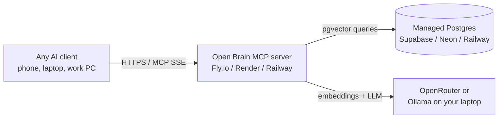

# Open Brain — Cheap Hosted (Supabase + Fly.io & friends)

> Always-on, accessible from every device you own, no homelab required. **$0–5/month** if you stay on free tiers, ~$10/month for a comfortable always-warm setup.

This guide covers the original *spirit* of Nate B Jones' Open Brain — a tiny, hosted, low-cost stack — adapted to OpenBrain's Node + Postgres architecture.

You'll pick **one** Postgres provider and **one** place to host the MCP server. They're independent choices.

---

## What You're Building



Three building blocks, all on someone else's hardware:

| Block | Options | Free tier? |
|-------|---------|-----------|
| **Postgres + pgvector** | Supabase · Neon · Railway · Render · Fly Postgres | ✅ all |
| **MCP server runtime** | Fly.io · Render · Railway · Koyeb | ✅ all (with caveats) |
| **Embedding model** | OpenRouter API · Ollama on your laptop | OpenRouter ~$0.10/mo · Ollama $0 |

---

## Step 1 — Pick a Postgres provider

All four of these have **pgvector built in** and a free tier that fits a personal "second brain" comfortably (Open Brain stores ~1–5 KB per thought; 1000 thoughts ≈ 5 MB + embeddings).

| Provider | Free tier | Pros | Cons | Best for |
|----------|-----------|------|------|----------|
| **Supabase** | 500 MB DB · 2 projects · paused after 1 week idle | Beautiful UI, SQL editor, auth/storage if you grow into it, closest match to Nate's original | Free DBs pause when idle (~30 sec cold start) | **Most people** — recommended starting point |
| **Neon** | 0.5 GB · *serverless* Postgres · auto-scales to zero | Cold starts <1 sec, branches like git, generous limits | Slightly newer ecosystem | Devs who want git-style DB branches |
| **Railway** | $5 trial credit, then ~$5/mo for tiny PG | Simplest deploy of *everything* (PG + MCP in one place) | No real "free forever" tier | One-stop deploy with MCP server alongside |
| **Render** | 1 GB free PG, **expires after 90 days** | Easy UI, generous CPU | DB expires — must upgrade or migrate | Short-term testing |
| **Fly Postgres** | 3 GB free across all volumes | Same region as your Fly MCP app = lowest latency | DIY UI (psql / pgAdmin) | Already deploying MCP on Fly |

> **Recommendation:** Start with **Supabase** if you want a nice UI and the closest experience to Nate's original design. Switch to **Neon** if Supabase's idle pausing annoys you.

### Supabase walkthrough (recommended)

1. Go to [supabase.com](https://supabase.com) → sign in with GitHub → **New project**.
2. Name: `openbrain`. Generate & save a strong DB password. Pick a region near you. Free tier.
3. Wait ~2 minutes for provisioning.
4. Open **SQL Editor** → **New query** → paste the contents of [`db/init.sql`](../db/init.sql) → **Run**.

   > ⚠️ **Change `vector(768)` to `vector(1536)`** at the top of `init.sql` if you're using OpenRouter (`text-embedding-3-small`). Keep `768` if you'll point at a local Ollama. You **cannot** change vector dimensions after the table exists without recreating it.

5. Apply the migrations in [`db/migrations/`](../db/migrations/) in order, same way.
6. **Settings → Database → Connection string → URI**. Copy it. It looks like:

   ```
   postgresql://postgres.<ref>:<password>@aws-0-<region>.pooler.supabase.com:6543/postgres
   ```

   Use the **pooler** connection (port 6543) — Supabase's free tier limits direct connections.

### Neon walkthrough (alternative)

1. [neon.tech](https://neon.tech) → sign in → **New project**.
2. Region near you. Postgres 17.
3. **SQL Editor** → paste & run `db/init.sql` (same dimension note as above).
4. **Dashboard → Connection Details → pooled connection string**. Copy it.

### Railway walkthrough (alternative)

1. [railway.app](https://railway.app) → **New Project → Provision PostgreSQL**.
2. The PG instance comes with pgvector pre-installed on recent images. If `CREATE EXTENSION vector` fails, switch the image to `pgvector/pgvector:pg17` in the service settings.
3. Open the PG service → **Data** → run `db/init.sql`.
4. **Variables → DATABASE_URL** — copy it.

---

## Step 2 — Pick where to run the MCP server

The MCP server is a small Node app (`dist/index.js`). It needs ~256 MB RAM and an HTTPS endpoint. Any of these will host it for free or near-free:

| Host | Free tier | Cold starts | Best for |
|------|-----------|-------------|----------|
| **Fly.io** | 3 × `shared-cpu-1x` 256 MB VMs free | ~1 sec from suspend | **Recommended** — best price/perf, anywhere in the world |
| **Railway** | $5 trial, then ~$5/mo | None (always-on) | Same place as your Postgres if you picked Railway |
| **Render** | Free web service, sleeps after 15 min idle | ~30 sec cold start | Fine for personal use you don't mind waking up |
| **Koyeb** | 1 nano service free | ~1 sec | Solid Fly alternative |
| **Your laptop via tunnel** | $0 | None (when laptop is on) | Use [Cloudflare Tunnel](https://developers.cloudflare.com/cloudflare-one/connections/connect-networks/) or [Tailscale Funnel](https://tailscale.com/kb/1223/funnel) — only reachable when your laptop is up |

> **Recommendation:** **Fly.io**. It's the closest experience to "deploy to a cheap VPS but with no VPS to manage", has real-world cold starts measured in *seconds*, and the free tier comfortably hosts Open Brain.

### Fly.io walkthrough (recommended)

A ready-made `fly.toml` is in [`deploy/hosted/fly/`](../deploy/hosted/fly/).

```bash
# Install flyctl
# Windows:  iwr https://fly.io/install.ps1 -useb | iex
# macOS:    brew install flyctl

fly auth signup            # or `fly auth login`

cd deploy/hosted/fly
fly launch --copy-config --no-deploy --name openbrain-<your-handle>

# Set secrets (these become env vars in the container)
fly secrets set \
  DATABASE_URL='postgresql://...your supabase/neon URL...' \
  MCP_ACCESS_KEY="$(openssl rand -hex 32)" \
  EMBEDDER_PROVIDER=openrouter \
  OPENROUTER_API_KEY='sk-or-...' \
  EMBEDDING_DIMENSIONS=1536

fly deploy
```

You'll get a URL like `https://openbrain-<your-handle>.fly.dev`. Verify:

```bash
curl https://openbrain-<your-handle>.fly.dev/health
```

> **Cost:** Stays inside the free allowance if you keep the machine on `shared-cpu-1x@256MB` and don't add a second region. Set `auto_stop_machines = "suspend"` (already in the template) so it suspends when idle — wake-up is ~1 second.

### Render walkthrough (alternative)

A `render.yaml` blueprint is in [`deploy/hosted/render/`](../deploy/hosted/render/). Push your fork to GitHub, then in Render → **New → Blueprint → connect repo**.

### Railway walkthrough (alternative)

A `railway.json` template is in [`deploy/hosted/railway/`](../deploy/hosted/railway/). `railway up` from that directory will deploy.

---

## Step 3 — Pick an embedder

| Embedder | Cost | Vector dims | Set up |
|----------|------|-------------|--------|
| **OpenRouter** (recommended for hosted) | ~$0.10–$0.30/month for personal use | 1536 | [openrouter.ai/keys](https://openrouter.ai/keys) — set `OPENROUTER_API_KEY` |
| **Ollama on your laptop, tunneled to the hosted MCP** | $0 | 768 | Run Ollama locally, expose via Tailscale, point `OLLAMA_ENDPOINT` at the Tailscale URL |
| **Azure OpenAI** | Pay-per-token (cheap) | 1536 | See [10-AZURE-DEPLOYMENT.md](10-AZURE-DEPLOYMENT.md#azure-openai) for keys |

> **Recommendation:** OpenRouter. The cost is rounding-error for personal use, the latency is good, and you don't need your laptop on for the MCP server to respond.

> ⚠️ The embedder's vector dimension must match the `vector(N)` you used in `db/init.sql` and the `EMBEDDING_DIMENSIONS` env var. If you change embedders later, you need to migrate (re-embed every thought into a new column).

---

## Step 4 — Connect your AI client

Same as the other paths, just point at your hosted URL:

```json
{
  "servers": {
    "openbrain": {
      "type": "sse",
      "url": "https://openbrain-<your-handle>.fly.dev/sse?key=YOUR_MCP_ACCESS_KEY"
    }
  }
}
```

Verify end-to-end:

```bash
OPENBRAIN_API_URL=https://openbrain-<your-handle>.fly.dev \
  npm run test:integration
```

All 27 tests should pass.

---

## Cost calibration

A realistic personal-use estimate, all-in:

| Item | Cost | Notes |
|------|------|-------|
| Supabase free DB | $0 | Pauses when idle, wake-up ~30 sec |
| Fly.io `shared-cpu-1x@256` suspended | $0 | Free allowance |
| OpenRouter embeddings @ 20 thoughts/day | ~$0.15/mo | `text-embedding-3-small` |
| **Total** | **~$0.15/mo** | |

To avoid Supabase's idle pause (always-warm DB), upgrade Supabase to Pro (~$25/mo) **or** switch to Neon (free, serverless, ~1 sec cold start) **or** Railway Postgres (~$5/mo, always-on).

---

## Trade-offs vs. other paths

| | Hosted | [Docker Desktop dev box](11-DOCKER-DESKTOP-DEVBOX.md) | [Azure](10-AZURE-DEPLOYMENT.md) |
|---|---|---|---|
| Reachable from any device | ✅ | ❌ laptop only | ✅ |
| Works when laptop is off | ✅ | ❌ | ✅ |
| Data on your hardware | ❌ (provider) | ✅ | ❌ (Microsoft) |
| Cost | $0–5/mo | $0 | ~$15–20/mo |
| Setup time | ~30 min | ~10 min | ~20 min |
| One-command deploy | Partial | ✅ | ✅ |
| Cold starts | Sometimes | None | None (Container Apps warm) |

---

## What's next?

- **Want zero cold starts and a managed everything?** → [10-AZURE-DEPLOYMENT.md](10-AZURE-DEPLOYMENT.md)
- **Want fully private, on your hardware?** → [11-DOCKER-DESKTOP-DEVBOX.md](11-DOCKER-DESKTOP-DEVBOX.md) or [09-SELF-HOSTED-K8S.md](09-SELF-HOSTED-K8S.md)
- **Want to prompt your AI clients to actually use Open Brain?** → [06-PROMPT-KIT.md](06-PROMPT-KIT.md)
